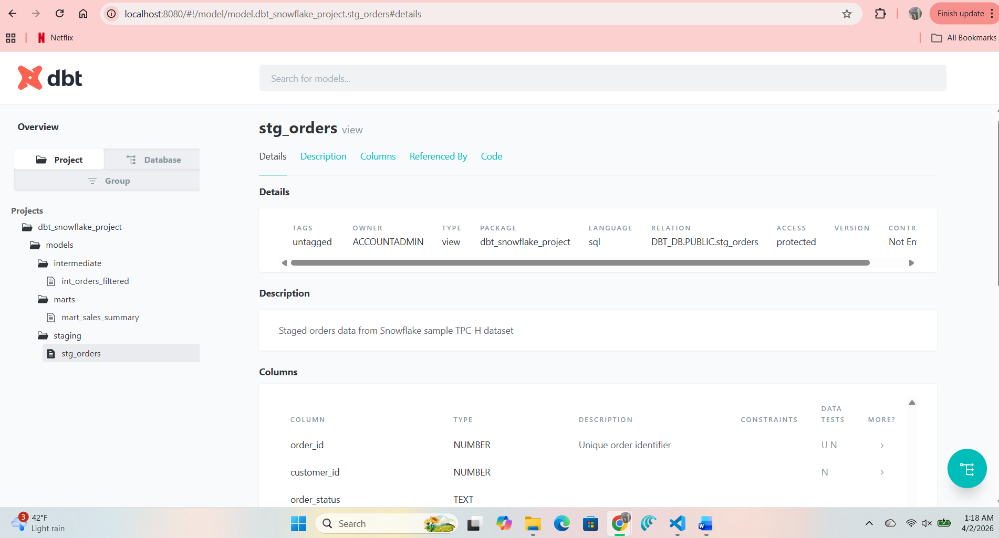

# dbt Snowflake Transformation Project

A multi-layer data transformation project built with dbt Core and Snowflake. This project transforms raw TPC-H order data from Snowflake's built-in sample dataset through three structured layers — staging, intermediate, and marts — with automated data quality tests at each layer.

---

## Tech Stack
- **Transformation Tool:** dbt Core 1.11.7
- **Data Warehouse:** Snowflake
- **Language:** SQL
- **Dataset:** Snowflake Sample Data (TPC-H SF1 — Orders table, 1.5M+ records)
- **Tools:** VS Code

---

## Architecture

```
Snowflake Sample Data (raw)
        ↓
staging/stg_orders        → cleans and selects relevant columns
        ↓
intermediate/int_orders_filtered  → filters fulfilled orders over $1,000
        ↓
marts/mart_sales_summary  → aggregates daily revenue and order counts by priority
```

---
## Documentation Map

---

## Project Structure

```
dbt_snowflake_project/
├── models/
│   ├── staging/
│   │   └── stg_orders.sql           # Raw layer: selects and renames columns
│   ├── intermediate/
│   │   └── int_orders_filtered.sql  # Filters fulfilled orders > $1,000
│   └── marts/
│       └── mart_sales_summary.sql   # Daily revenue summary by order priority
├── models/schema.yml                # Data quality tests
├── dbt_project.yml
└── README.md
```

---

## Data Quality Tests
8 automated tests defined in `schema.yml` — all passing:
- `unique` and `not_null` on order IDs
- `not_null` on customer ID, total price, total orders, total revenue

```
PASS=8  WARN=0  ERROR=0  TOTAL=8
```

---

## How to Run

```bash
# 1. Clone the repo
git clone https://github.com/NitishChowdaryK/dbt-snowflake-project.git
cd dbt-snowflake-project

# 2. Create and activate virtual environment
python -m venv venv
venv\Scripts\activate

# 3. Install dbt for Snowflake
pip install dbt-snowflake

# 4. Set up your Snowflake profile
dbt init dbt_snowflake_project

# 5. Test the connection
dbt debug --project-dir dbt_snowflake_project

# 6. Run all models
cd dbt_snowflake_project
dbt run

# 7. Run data quality tests
dbt test

# 8. Generate and view documentation
dbt docs generate
dbt docs serve
```

---

## Sample Output

```
05:09:07  Found 3 models, 523 macros
05:09:10  1 of 3 START sql view model PUBLIC.stg_orders ................. [RUN]
05:09:11  1 of 3 OK created sql view model PUBLIC.stg_orders ............ [SUCCESS in 1.26s]
05:09:11  2 of 3 START sql view model PUBLIC.int_orders_filtered ......... [RUN]
05:09:12  2 of 3 OK created sql view model PUBLIC.int_orders_filtered .... [SUCCESS in 0.42s]
05:09:12  3 of 3 START sql view model PUBLIC.mart_sales_summary .......... [RUN]
05:09:12  3 of 3 OK created sql view model PUBLIC.mart_sales_summary ..... [SUCCESS in 0.38s]

Completed successfully. PASS=3 WARN=0 ERROR=0 TOTAL=3
```

---

## Skills Demonstrated
- Multi-layer dbt transformation (Staging → Intermediate → Marts)
- Data warehouse modeling on Snowflake
- Automated data quality testing with dbt tests
- SQL-based aggregation and filtering logic
- dbt documentation generation
- Working with large-scale datasets (1.5M+ records)